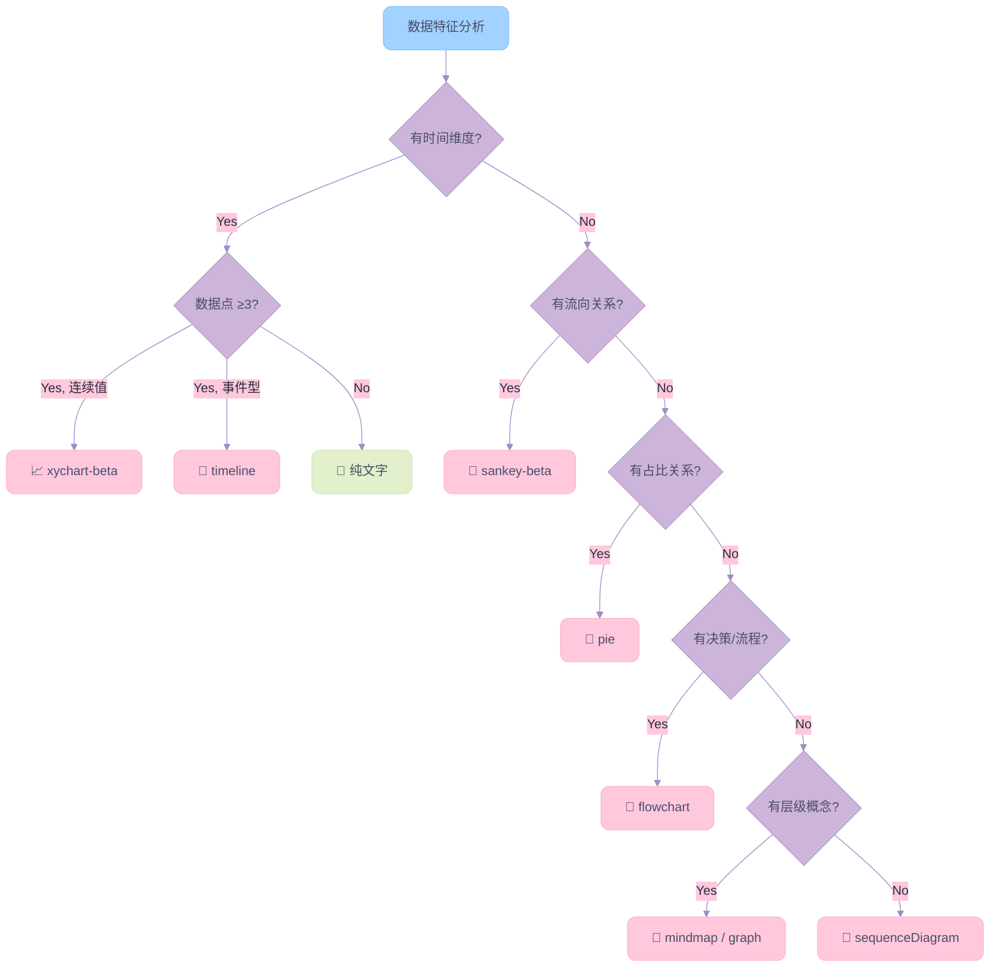

# Mermaid Chart（文档可视化增强）

## 功能概述

本技能的核心使命是**增强 Markdown 文档的可视化表达能力**——不仅仅是"画图表"，而是完整的 **洞察 → 生成 → 验证** 闭环：

1. **内容洞察 (L0)**：扫描 Markdown 内容，识别哪些段落适合用图表替代或增强文字叙述
2. **图表选型 (L1)**：基于数据特征选择最优图表类型
3. **图表生成 (L2)**：基于 Healing Dream 设计系统生成高品质 Mermaid 图表
4. **深度洞察 (Key Insights)**：每个图表的核心价值产出——提炼图表揭示的关键发现、趋势和风险
5. **质量验证 (L3)**：通过 SCSH 管线自动验证渲染质量

> [!IMPORTANT] 核心价值定位
> 增加图表的**真正价值**不在于图表本身，而在于图表所承载的**深度洞察 (Key Insights)**。
> 图表是数据的视觉载体，Key Insights 是图表的**灵魂**。没有 Key Insights 的图表只是装饰。

## 使用时机

**使用此技能**：

- 📈 **时间序列数据**（≥3 个数据点）→ 折线图 / 柱状图
- 🥧 **结构占比**（2-8 个分段）→ 饼状图
- 🔀 **流程 / 决策 / 架构**（≤12 个节点）→ 流程图
- 🧩 **概念关系 / 逻辑结构** → 概念图
- 🔄 **多维对比**（2-4 个指标）→ 多线折线图
- 🌊 **资金/能源流向**（如财报营收拆解）→ 桑基图
- 📅 **历史里程碑 / 事件演进**（≥4 个时间节点）→ 时间线图
- 🔍 **用户要求"优化文档可视化"** → 全文扫描，逐章节增加图表

**不要使用**：

- 单一数值 → 直接文字回答
- 复杂多维（>5 维度）→ Markdown 表格更合适
- 数据点 <3 → 文字说明即可

---

## 执行工作流

### 整体架构：两大迭代

```text
┌─────────────────────────────────────────────────┐
│          迭代 1：逐章节 — 洞察·生成·注入          │
│                                                   │
│  For each chapter:                                │
│    Step 0: 内容扫描 → 识别可视化机会              │
│    Step 1: 图表选型 → 匹配最优图表类型            │
│    Step 2: 图表生成 → Healing Dream 配色注入      │
│    Step 3: Key Insights → 深度洞察输出            │
│    Step 4: 注入源文件 → 图表+Insights 写入 MD     │
│                                                   │
├─────────────────────────────────────────────────┤
│          迭代 2：批量 — 质量验证与修复             │
│                                                   │
│  所有章节完成后，整文件执行一次：                  │
│    Step 5: SCSH 管线 → 渲染+审查+自动修复         │
│    Step 6: 平台兼容确认                           │
│                                                   │
└─────────────────────────────────────────────────┘
```

> [!TIP] 为什么分两个迭代？
> 迭代 1 聚焦**内容价值**（该加什么图、Key Insights 是什么），迭代 2 聚焦**渲染质量**（图表是否可渲染、布局是否美观）。
> 先完成所有内容注入，再统一跑 SCSH，避免每加一个图表就触发一次验证的效率浪费。

---

### 迭代 1：逐章节 — 洞察·生成·注入

#### Step 0: 内容扫描与可视化机会识别

Agent **必须**先扫描目标 Markdown 文件全文，逐章节识别可视化机会。这是本技能的**核心起点**。

**可视化信号检测矩阵**：

| 内容模式 | 信号特征 | 推荐图表 | 优先级 |
|----------|---------|----------|:------:|
| 连续数字表格（3+行 × 2+列，含时间列） | 季度/年度财务数据、增长率序列 | `xychart-beta` line/bar | 🔴 高 |
| 占比/份额描述 | "占比 XX%"、"市场份额"、"结构" | `pie` | 🔴 高 |
| 步骤/阶段描述 | "第一步...第二步"、"流程"、"pipeline" | `flowchart` | 🟡 中 |
| 因果/依赖关系 | "A 导致 B"、"依赖于"、"触发" | `flowchart` | 🟡 中 |
| 时间顺序事件 | 年份 + 事件列表、里程碑 | `timeline` | 🟡 中 |
| 资金/能量流动 | "Revenue → Cost → Profit"、收入拆解 | `sankey-beta` | 🟡 中 |
| 层级分类 | "分为 A/B/C 三类"、"包含 X 个子类" | `mindmap` / `graph` | 🟢 低 |
| 纯定性对比表格 | 2-4 实体 × 多维度文字对比 | ❌ 保留表格 | — |

**Agent 必须输出可视化洞察声明**：

```text
> [可视化洞察] 文件 {path} 扫描完毕
> 章节 "{chapter_title}" 发现 {N} 处可视化机会：
>   1. 行 {L}: {段落摘要} → 推荐 {chart_type} (📈 趋势数据)
>   2. 行 {L}: {段落摘要} → 推荐 {chart_type} (🥧 占比结构)
>   3. 行 {L}: 纯文字叙述，无可视化需求 → 跳过
```

> [!CAUTION] 过度图表化警告
> 并非所有内容都适合图表化。**定性描述、战略叙述、风险分析等文字段落**的表达力远超图表。
> Agent 应克制添加图表的冲动，只在图表**确实优于**文字时才推荐（Signal-to-noise ratio）。

#### Step 1: 图表选型

参照全景矩阵和选型决策树快速定型：

| 数据特征 | 推荐图表 | Mermaid 语法 |
| -------- | -------- | ------------ |
| 时间序列趋势 | 折线图 | `xychart-beta` + `line` |
| 分类数值对比 | 柱状图 | `xychart-beta` + `bar` |
| 结构占比 | 饼状图 | `pie` |
| 流程/决策/架构 | 流程图 | `graph TD` 或 `graph LR` |
| 概念关系 | 概念图 | `graph TD` + classDef |
| 资金/能源流向 | 桑基图 | `sankey-beta` |
| 历史里程碑 | 时间线图 | `timeline` |

> [!TIP] 快速判断
> **有时间轴？** → xychart / timeline。**有占比？** → pie。**有流向？** → sankey。
> **有决策分支？** → flowchart。**有层级概念？** → graph + classDef。

#### Step 2: 图表生成

1. **查阅配色模板**：从 `resources/chart_templates/` 中复制对应图表类型的 Healing Dream 配色 JSON
2. **CJK 前置检查**：含中文时必须输出 CJK 研判声明（详见 `## CJK 安全策略`）
3. **填充真实数据**：严禁虚构数值，金额单位统一（B/M/K）
4. **布局优化**：检查方向/换行/溢出（详见 `## 布局与容量约束`）

**配色模板文件**（按图表类型查阅）：

| 图表类型 | 模板文件 |
|----------|---------|
| 折线图 | `resources/chart_templates/line_chart.md` |
| 柱状图 | `resources/chart_templates/bar_chart.md` |
| 饼状图 | `resources/chart_templates/pie_chart.md` |
| 流程图/概念图 | `resources/chart_templates/flowchart.md` |
| 桑基图 | `resources/chart_templates/sankey_chart.md` |
| 时间线图 | `resources/chart_templates/timeline_chart.md` |
| **其他/未知类型** | `resources/chart_templates/common_chart.md` *(自动兜底)* |

#### Step 3: Key Insights — 图表的灵魂

> [!IMPORTANT] 核心价值产出
> Key Insights 是增加图表的**根本意义**。图表将数据视觉化，Insights 将视觉转化为**认知**。
> 每个图表后**必须**跟随 Key Insights，否则图表只是无灵魂的装饰。

**每个图表后必须跟随：**

```markdown
**Key Insights:**
- 🏆 **[关键发现]**: [具体数据] + [这意味着什么]
- 📈 **[趋势洞察]**: [数据变化] + [背后的驱动因素]
- ⚠️ **[风险/关注]**: [异常信号] + [潜在影响]
```

**质量标准**：

| 维度 | 合格 | 不合格 |
|------|------|--------|
| 数据支撑 | "Revenue +35.9% YoY，连续 6 季加速" | "增长强劲" |
| 因果推理 | "Data Center 占 88% → 客户集中度风险" | "占比最大" |
| 行动导向 | "GPM 扩张至 75% → 估值重评估催化剂" | "毛利率高" |
| 对比锚点 | "vs 行业均值 45%，溢价 30pp" | "远超同行" |

#### Step 4: 注入源文件

将图表代码块 + Key Insights 写入 Markdown 源文件的对应章节位置。

---

### 迭代 2：批量 — 质量验证与修复

#### Step 5: SCSH 自检与修复

> [!CAUTION] SCSH 零豁免与防死循环原则
>
> 1. **零豁免**：**任何**对 Mermaid 代码块的修改完成后都**必须**运行 SCSH 管线验证。**不存在"低风险跳过"的例外**。
> 2. **严禁无限优化**：如果自动调用脚本优化 2 轮之后，依然存在未通过审查的图表，**必须立即停止优化并跳过**。严禁技能无限制地调用脚本进行死循环式的优化。
>
> Agent 在迭代 1 全部完成后，**必须输出以下触发声明**，再执行 SCSH 命令：
>
> ```text
> > [SCSH 触发] 已修改 {N} 个 Mermaid 块于 {文件路径}
> >   修改类型: {新建/配色注入/数据更新/布局重构}
> >   即将执行 SCSH 管线验证...
> >   (注：严格遵守 2 轮最大重试原则，超时即跳过)
> ```

**调用方式**：

```bash
eval "$(conda shell.bash hook)"
conda activate marker
python3 /path/to/.agent/skills/mermaid-chart/scripts/mermaid_scsh.py \
    --file "/path/to/target.md" --auto-fix
```

**CLI 参数说明**：

| 参数 | 默认值 | 说明 |
|------|--------|------|
| `--file FILE` | **必填** | 目标 Markdown 文件路径 |
| `--auto-fix` | 关闭 | 启用自动修复回写：审查通过或历史最高分版本自动覆盖源文件中的 Mermaid 块 |
| `--max-retries N` | `2` | 每个图表的最大重试次数（Gemini 修复→L1 校验→重渲染循环） |
| `--pass-score N` | `7` | 通过分数阈值（布局+配色+可读性综合分 ≥N 视为通过） |
| `--model MODEL` | `gemini-3-flash-preview` | Gemini Vision 审查模型名称 |
| `--work-dir DIR` | `.build_chart` | 构建目录路径（相对于源文件目录） |
| `--dry-run` | 关闭 | 仅审查，不修改源文件（即使搭配 `--auto-fix` 也不回写） |

**SCSH 3-Step Pipeline**：

```text
for each chart (max_retries + 1 轮):
  Step 1: l1_sanitize(code) → mmdc 渲染 PNG
          失败 → return failed
  Step 2: Gemini Vision 审查 (PNG + code)
          通过 → return passed → auto-fix 回写源文件
          API异常 → return needs_intervention
  Step 3: 校验 fix_code (l1_sanitize) → 更新 best → 下一轮
```

**构建目录** `.build_chart/`（源文件同级，自动创建）：

```text
.build_chart/
├── build.log                    ← 完整控制台日志（双通道写入）
├── api_trace.log                ← Gemini API 请求/响应审计日志
├── {file_stem}_chart_N.mmd/png  ← 图表渲染产物（按源文件名编号）
└── mermaid-font.css             ← CJK 字体注入
```

#### Step 6: 平台兼容确认

发布前确认目标平台（Obsidian / GitHub / PDF）的渲染兼容性，参考 `## 跨平台渲染差异` 章节。

---

## 设计系统：Healing Dream

### 调色板

```text
主色系：
  '#A2D2FF'  清透青 — 主流程 / 核心
  '#CDB4DB'  淡奶紫 — 决策节点 / 连线
  '#FFC8DD'  蜜桃粉 — 结果 / 终点
  '#BDE0FE'  冰雪蓝 — 辅助流程
  '#FFAFCC'  樱花粉 — 增长 / 强调
  '#E2F0CB'  薄荷绿 — 次要 / 其他

文字与背景：
  '#2B2D42'  深薰衣草枪灰 — 文字色 (High Contrast)
  '#FAFAFA'  极浅灰 — 背景色

子图 (Subgraph)：
  '#F8FAFC'  极浅灰 — 子图背景色 (clusterBkg)
  '#CBD5E1'  柔灰 — 子图边框色 (clusterBorder) ← 推荐

深色系（柱状图 / 对比强调）：
  '#4A4E69'  深枪灰 Gunmetal — 柱状图首色
  '#9D8EC7'  深紫 Deep Purple — 柱状图第 2 色
  '#64748B'  石板灰 Slate — 柱状图第 3 色
```

### 配色注入三大法则

1. **扁平放置 (Flat)**：`pie`、`flowchart`、`timeline` 的配色变量与 `themeVariables` 平级
2. **对象嵌套 (Nested)**：`xychart-beta` 嵌套在 `xyChart: {}`；`sankey-beta` 嵌套在 `sankey: {}`
3. **全局背景**：`background` 永远放在 `themeVariables` 顶层

### 深色/浅色选择原则

| 图表元素 | 推荐色系 | 原因 |
|----------|---------|------|
| 折线 (line) | **浅色系** | 细线条在浅背景上足够可见 |
| 柱状 (bar) | **深色系** | 大面积填色，浅色在白底上消失 |
| 饼图分段 | 浅色系 | 扇区面积大，浅色更柔和 |
| 流程图节点 | 浅色系 | 节点内有文字，浅底深字对比好 |
| 桑基图流向 | 浅色系 | 半透明流带，浅色更梦幻 |
| 时间线区段 | 浅色系 | 区段背景色，浅色承载文字 |

---

## 布局与容量约束

### 布局规范

- **目标宽度**：720px，优先纵向布局 `graph TD`
- **换行**：节点文本每 15-20 字符用 `<br/>` 换行，**严禁 `\n`**
- **换行例外**：`timeline` 不支持 `<br/>`，用多 `:` 条目换行
- **横向限制**：同层级横向节点 ≤5 个
- **圆角**：所有节点 `rx:10, ry:10`

### 容量纪律

| 图表类型 | 容量上限 | 超限后果 |
|----------|---------|---------:|
| `xychart` line | ≤3 条线 | 线条密集不可读 |
| `xychart` bar | **仅 1 条 bar** | 多 bar 遮挡 |
| `pie` | ≤8 段 | 标签重叠 |
| `flowchart` | ≤12 节点 | 布局失控 |
| `sankey-beta` | ≤20 流 | 线条交织 |
| `timeline` | ≤8 节点 | 横向溢出 |
| `sequenceDiagram` | ≤8 参与者 | 横向拥挤 |
| 子图嵌套 | ≤2 层 | >3 层不可控 |

### 横向溢出控制

| 图表类型 | 溢出风险 | 触发条件 | 解决方案 |
|----------|---------|---------|---------:|
| flowchart LR | 🔴 高 | 同层 >5 节点 | 切换 TD 或拆分子图 |
| timeline | 🔴 高 | >8 节点 / 使用 section | 减少节点 + 去 section |
| xychart | 🟡 中 | X 轴 >12 项 | 缩写标签 |
| sankey | 🟡 中 | 节点名过长 | 缩写英文标签 |
| pie | 🟢 低 | >8 分段 | 合并为 Others |

---

## CJK 安全策略

### 兼容矩阵

| 图表类型 | 标题 | 标签 | 整体评级 | 关键问题 |
|----------|:----:|:----:|:-------:|---------:|
| flowchart | ✅ | ✅ (引号) | 🟢 完全支持 | 中文标签必须 `["中文"]` |
| pie | ✅ | ✅ | 🟢 完全支持 | — |
| xychart | ✅ | ✅ | 🟢 完全支持 | `title "中文"`, `x-axis ["中文"]` |
| quadrantChart | ⚠️ | ⚠️ | 🟡 **全引号** | 所有 CJK 文本（轴/象限/数据点）必须双引号 |
| sequence | ✅ | ✅ | 🟢 完全支持 | `participant A as "中文名"` |
| timeline | ✅ | ⚠️ | 🟡 有条件 | 每条 ≤12 汉字 |
| mindmap | ✅ | ⚠️ | 🟡 有条件 | 深层节点中文可能错位 |
| **sankey** | ❌ | ❌ | 🔴 **硬阻断** | **仅 ASCII，一律英文** |

### 🚨 CJK 致命陷阱（实战踩坑 Top 5）

> [!CAUTION] 以下规则来自 30+ 图表的实际渲染修复闭环，违反任何一条将导致图表无法渲染。

**陷阱 1：quadrantChart CJK 全引号规则**

quadrantChart 的词法分析器对非 ASCII 字符无法识别 token 边界。**所有含 CJK 的文本必须用双引号包裹：**

```
❌ x-axis 审慎｜反对 --> 积极推动
✅ x-axis "审慎｜反对" --> "积极推动"

❌ 中央政府: [0.35, 0.90]
✅ "中央政府": [0.35, 0.90]
```

**陷阱 2：flowchart 节点标签禁止 ASCII `[]`**

ASCII `[` 是 Mermaid 的**节点形状语法符**。在 `["..."]` 字符串内部出现 `[`，解析器会误判为嵌套节点定义，报 `SQS` token 错误。用**中文全角方括号 `【】`** 替换：

```
❌ L1["[统筹层] 领导小组"]     → SQS parse error
❌ L1[""[统筹层"] 领导小组"]   → SCSH auto-fix 产物，更严重
✅ L1["【统筹层】领导小组"]    → 安全
```

**陷阱 3：`classDef` 不支持 `rx` / `ry`（mmdc v10.x）**

`rx:8,ry:8` 不是标准 CSS 属性，mmdc 解析到此处时行尾状态异常，导致后续行的引号匹配出错：

```
❌ classDef level1 fill:#E0F2FE,stroke:#7DD3FC,rx:8,ry:8
✅ classDef level1 fill:#E0F2FE,stroke:#7DD3FC,stroke-width:2px
```

**陷阱 4：`<b>` HTML 标签与 `[""]` 语法冲突**

`<b>[文字]</b>` 中的 `[` 在 `htmlLabels: true` 模式下被优先解析为节点标记。用 `classDef font-weight:bold` 替代：

```
❌ L1["<b>[统筹层]</b> 领导小组"]
✅ classDef bold font-weight:bold
   L1["【统筹层】领导小组"]:::bold
```

**陷阱 5：quadrantChart CJK 标签间距过小导致文字覆盖**

CJK 字符宽度约为 Latin 的 1.5-2 倍。相邻数据点最小间距规则：

| 维度 | CJK 最小间距 | Latin 最小间距 |
|------|:-----------:|:------------:|
| X 轴 | ≥ 0.12 | ≥ 0.08 |
| Y 轴 | ≥ 0.10 | ≥ 0.06 |
| 对角线 | ≥ 0.15 | ≥ 0.10 |

同象限超过 3 个数据点时，**必须手动交错偏移 (stagger)**。

**陷阱 6：保留字 `end` 导致晦涩的 Parse error**

Mermaid 的解析器底层使用 Jison，当把 `end`（或其他结构体保留字如 `subgraph`）作为 `classDef` 或节点 ID 时，会报出极其晦涩的 `Expecting 'AMP', 'COLON'... got 'end'` 语法错误。此报错**不会提示你使用了保留字**，极易误导排错方向。

```
❌ classDef end fill:#A2D2FF
   (报错: Parse error... got 'end')
✅ classDef endNode fill:#A2D2FF
```

### SCSH Auto-Fix 安全红线

> [!WARNING] SCSH `--auto-fix` 会覆写源文件
> Gemini Vision 建议的修复可能重新引入 `""[...]"` 格式，导致源文件被破坏。
>
> **防御策略**：
>
> 1. 对已知 CJK 方括号问题的图表，先修复为 `【】` 再运行 SCSH
> 2. 使用 `--only-charts "N"` 指定图表索引，避免全量覆写
> 3. SCSH 运行后立即 diff 检查变更

### Anti-drift 研判声明

> [!WARNING] Anti-drift 机制
> Agent 在生成含中文图表前，**必须先输出研判声明**：
>
> ```text
> > [系统研判] 将生成 {图表类型}，检测到包含中文，确认：
> >   ✅ CJK 兼容评级为 {🟢/🟡/🔴}
> >   ✅ 所有节点/标签已采取 ["文本"] 安全闭合策略
> >   ✅ 无 ASCII [] 裸方括号（已用【】替换）
> >   ✅ 无 classDef rx/ry 属性
> >   ✅ 容量 {N} 在上限 {MAX} 以内
> ```

### 引号包裹规范

| 图表元素 | 需要引号? | 示例 |
|----------|:--------:|------|
| flowchart 节点 | ✅ 必须 | `A["数据处理"]` |
| flowchart 子图 | ✅ 推荐 | `subgraph SG1["数据层"]` |
| flowchart 连线标签 | ✅ 推荐 | `A -->\|"成功"\| B` |
| pie 标签 | ✅ 已有 | `"标签" : 值` |
| xychart 标题 | ✅ 必须 | `title "中文标题"` |
| xychart X 轴 | ✅ 必须 | `x-axis ["标签1", "标签2"]` |
| quadrantChart 轴标签 | ✅ **必须** | `x-axis "低" --> "高"` |
| quadrantChart 象限名 | ✅ **必须** | `quadrant-1 "核心区"` |
| quadrantChart 数据点 | ✅ **必须** | `"中央政府": [0.35, 0.90]` |
| timeline 事件 | ❌ 不加 | `2024 : 事件描述` |
| sequence 参与者 | ✅ 推荐 | `participant A as "中文名"` |

---

## 图表选型决策树

在 **≤3 步**内确定最优图表类型：



### 全景矩阵

| 图表类型 | 语法 | 核心语义 | 最佳数据 | 容量上限 | 中文 | 配色入口 |
|----------|------|---------|----------|---------|------|---------|
| 折线图 | `xychart-beta` + `line` | 时间趋势 | 时间序列 ≥3 点 | ≤3 条线 | ✅ | `xyChart.plotColorPalette` |
| 柱状图 | `xychart-beta` + `bar` | 分类对比 | 离散 4-12 项 | **1 条 bar** | ✅ | `xyChart.plotColorPalette` |
| 饼状图 | `pie` | 结构占比 | 部分-整体 | ≤8 段 | ✅ | `pie1`-`pie8` |
| 流程图 | `graph TD/LR` | 流程/决策/架构 | 节点-边关系 | ≤12 节点 | ✅ | `primaryColor` 系列 |
| 桑基图 | `sankey-beta` | 资金/能源流向 | 源→目标→值 | ≤20 流 | ❌ | `sankey.nodeColor` |
| 时间线 | `timeline` | 里程碑/事件 | 按时间排序 | ≤8 节点 | ⚠️ | `cScale0`-`cScale9` |
| 概念图 | `graph TD` + `classDef` | 概念层级 | 分类-归属 | ≤12 节点 | ✅ | `primaryColor` 系列 |
| 序列图 | `sequenceDiagram` | 交互时序 | 消息传递 | ≤8 参与者 | ✅ | `primaryColor` 系列 |

---

## 技能包结构

```text
.agent/skills/mermaid-chart/
├── SKILL.md                          # 核心定义文件（本文档）
├── reference.md                      # SCSH 深度参考：审查规则 / 错误码 / 排错手册
├── resources/
│   ├── REVIEW_PROMPT.md              # Gemini Vision System Instruction 模板（v4.3 重构）
│   └── chart_templates/              # Healing Dream 配色模板（按图表类型）
│       ├── line_chart.md
│       ├── bar_chart.md
│       ├── pie_chart.md
│       ├── flowchart.md
│       ├── sankey_chart.md
│       ├── timeline_chart.md
│       └── common_chart.md           # v4.2 新增：通用兜底模板（未知/罕见图表类型）
└── scripts/
    └── mermaid_scsh.py               # SCSH 自检修复管线（asyncio 并发，v4.3）
```

---

## 跨平台渲染差异

### 平台对比矩阵

| 平台 | Mermaid 版本 | `%%{init}` 支持 | 注意事项 |
|------|-------------|:---------------:|---------:|
| **Obsidian** | v11.4.x (内置) | ✅ | `carousel` 不支持 |
| **GitHub** | 服务端沙箱 | ⚠️ 部分 | beta 图表可能滞后 |
| **VS Code** | 插件版 | ✅ | 需 Mermaid Preview 插件 |
| **mmdc CLI** | 用户安装版 | ✅ | 需配置 CJK 字体 |

### 跨平台最大公约数策略

1. 使用 stable 图表类型 (flowchart, pie, sequence)
2. 使用 `theme: base` + 最基础的 `themeVariables`
3. 中文标签一律双引号包裹
4. 在 Mermaid Live Editor 预览确认
5. 生产级场景用 mmdc 渲染 PNG → 嵌入文档

---

## 🚫 禁止事项

- ❌ 使用纯黑色 `#000000` 或锐利工业色
- ❌ 柱状图使用极浅色（如 `#A2D2FF`），务必用 `#4A4E69` 深枪灰
- ❌ 折线图 >3 条线 / 饼图 >8 分段 / 流程图 >12 节点
- ❌ Y 轴强制从 0 开始（除非数据需要）
- ❌ Key Insights 无数据支撑（"增长强劲" → 必须跟具体数据）
- ❌ 虚构数值
- ❌ 流程图 `subgraph` 不设置 `clusterBkg` 和 `clusterBorder`
- ❌ 桑基图使用中文标签、引号包裹或行内注释
- ❌ 时间线事件文本中使用冒号（`:` 或 `：`）
- ❌ 使用 `\n` 换行（必须 `<br/>`，timeline 用多 `:` 条目）
- ❌ `class SubgraphID className` 给 subgraph 分配样式（破坏 `clusterBkg`）
- ❌ `xychart` 的 `plotColorPalette` 放在 `themeVariables` 最外层（必须嵌套在 `xyChart:{}` 内）
- ❌ 使用 Obsidian Vault 文件中使用 `carousel` 语法
- ❌ 跳过 SCSH 验证——无论修改多"简单"
- ❌ **无限制死循环优化**——SCSH 自动修复达 2 次仍未通过时，必须果断跳过，严禁继续钻牛角尖
- ❌ 图表后不跟 Key Insights（图表无灵魂）

## 🚫 语法安全与保留字

Mermaid 解析器保留字，**严禁**用作 `id`、`class` 名或 `subgraph` 名：

`end`, `subgraph`, `classDef`, `style`, `click`, `callback`, `graph`, `flowchart`

- ❌ `classDef end fill:red` → ✅ `classDef result fill:red`
- 节点 ID 避免纯数字，用 `N1-->N2`
- 特殊字符必须引号包裹：`id["Label (Text)"]`

---

## 错误处理

| 问题 | 解决方案 |
| ---- | -------- |
| 中文标签乱码 | `["中文标签"]` 双引号包裹 |
| xychart 变浅黄 | `plotColorPalette` 必须嵌套在 `xyChart:{}` 内 |
| 子图挤压/标题遮挡 | `padding: 30` + `rankSpacing: 40` + `subGraphTitleMargin` |
| sankey 不渲染 | `sankey-beta` 后必须空行；禁中文/引号/`%%` 注释 |
| timeline 文字重叠 | 拆为多 `:` 条目（每条 ≤12 字） |
| timeline 冒号崩溃 | 文本中 `:` 用 `—` 或 `-` 替代 |
| 饼图/timeline 标题裁切 | `title` 缩小字体大小 |
| Obsidian 显示纯文字 | 检查是否误用 `carousel` 语法 |

---

## 未来演进

| 方向 | 状态 | 说明 |
|------|------|------|
| 暗色模式 (Healing Dream Dark) | 🔮 规划中 | 适配 Obsidian 暗色主题 |
| ELK 布局引擎 | 🔮 规划中 | 复杂流程图排版改善 |
| SCSH L4 (Lint-in-Editor) | 🔮 规划中 | 编辑时预防错误 |
| 新图表类型 (radar-beta, kanban) | 🔮 等待 Mermaid 稳定 | 需新增配色模板 |
