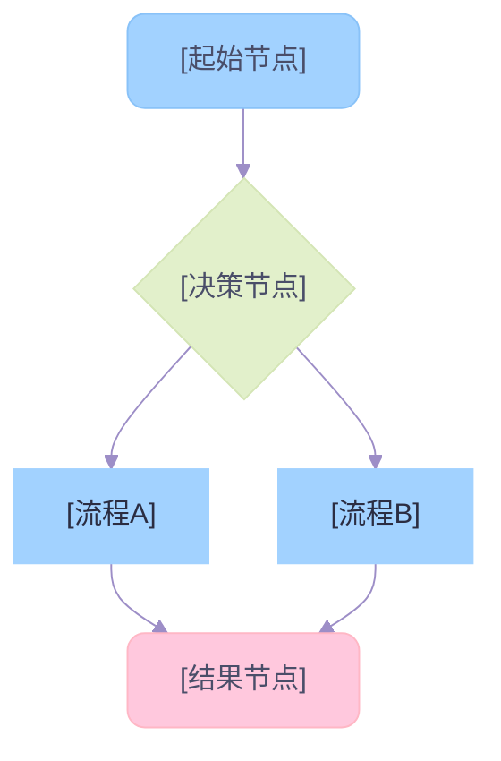

# 流程图 / 概念图 — 治愈系流转

## 配色模板



## 规范

- **节点数** ≤12，**文本换行** 每 15-20 字符 `<br/>`
- **连线色** `#CDB4DB`
- **子图**：必须设置 `clusterBkg: '#F8FAFC'` + `clusterBorder: '#CBD5E1'`，否则子图背景继承节点色
- **子图标题被遮挡**：设置 `padding: 30` + `rankSpacing: 40` + `subGraphTitleMargin: { top: 10, bottom: 10 }`

## 复杂矩阵布局 (Matrix Layout)

全局横向排列 + 局部纵向堆叠 + 隐形支撑线 `~~~`：

```mermaid
%%{init: { ... 同上配色，padding: 30 ... }}%%
flowchart LR
    subgraph A["模块 A (并排左)"]
        direction TB
        A1["极长节点1"] ~~~ A2["极长节点2"]
    end
    subgraph B["模块 B (并排右)"]
        direction TB
        B1["极长节点3"] ~~~ B2["极长节点4"]
    end
    A ~~~ B %% 强制子图之间保持横向距离
```
