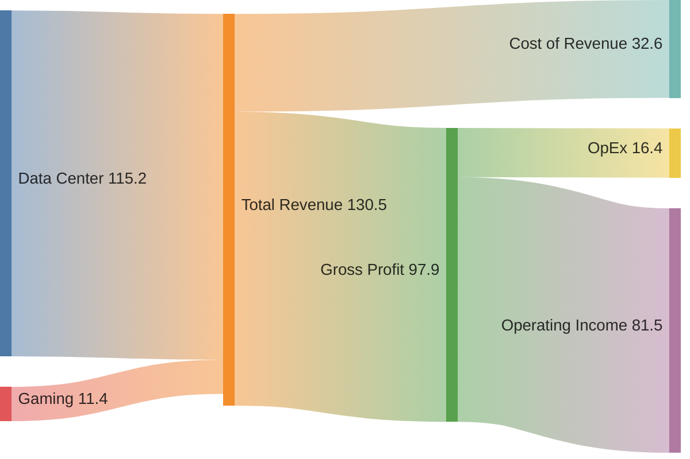

# 桑基图 — 资金流向

## 配色模板

```mermaid
%%{init: {
  'theme':'base',
  'themeVariables': {
    'sankey': {
      'nodeColor': '#A2D2FF',
      'linkColor': '#CDB4DB',
      'nodeTextColor': '#2B2D42'
    }
  }
}}%%
sankey-beta

Data Center, Total Revenue, 115.2
Gaming, Total Revenue, 11.4
Total Revenue, Cost of Revenue, 32.6
Total Revenue, Gross Profit, 97.9
Gross Profit, OpEx, 16.4
Gross Profit, Operating Income, 81.5
```

## 规范

- **格式**：每行 `Source, Target, Value`
- **标签**：**纯英文**（CJK 硬阻断 🔴），缩写英文标签
- **`sankey-beta` 后必须空一行**再写数据
- **容量**：≤20 流
- **禁止**：中文标签、双/单引号包裹、行内注释（`%%`）
