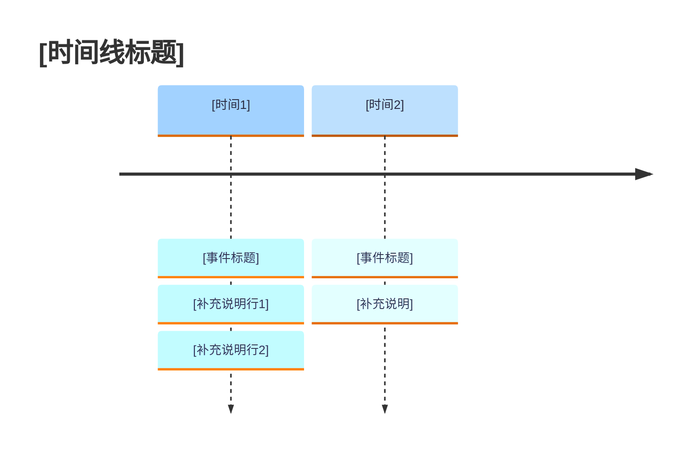

# 时间线图 — 里程碑叙事

## 配色模板

## 规范

- **节点数量**：4-8 个，超过 8 个应精简合并
- **多条目换行**：`timeline` **不支持 ` `**，只能通过多 `:` 条目实现换行
- **每条目长度**：≤12 汉字 / ≤25 英文字符
- **排版规则**：
  - 第一个 `:` 放事件标题（英文名称或核心概括）
  - 后续 `:` 放中文说明、数据、影响
  - 可用 emoji 前缀：📈 数据 / ⚠️ 风险 / 🚨 危机 / ⚔️ 对抗 / 🏆 成就
- **严禁冒号**：事件文本中禁止 `:` 和 `：`（用 `—` 或 `-` 替代）
- **标题裁切处理**：如果标题左侧被挤压，则采用将图表标题字体变小的优化方案。**严禁**使用 `>` 等符号进行视觉占位。

## 选型对比

| 场景 | 推荐图表 | 原因 |
| ---- | -------- | ---- |
| 事件按时间顺序线性排列 | `timeline` | 原生时间轴语义 |
| 事件有分叉/决策/并行路径 | `graph TD` | 流程图支持条件分支 |
| ≤8 个关键节点，强调阶段 | `timeline` | 简洁易读 |
| >12 个节点，强调关系 | `graph TD` | 时间线节点过多会拥挤 |
